# Login Screen Set-up in Adobe XD

[Download starter file](images/xd_states_interaction.xd)

[Watch video work-through here](https://solent.cloud.panopto.eu/Panopto/Pages/Viewer.aspx?id=49f8c653-b6a2-4917-9044-ac5f0175a475)

The canvas size is 360 x 760 pixels 

Set your grade 4 point

Margins are left & right are 16 pixels

We are going to make a login screen based on [Material Design guidelines](https://material.io/components/text-fields#anatomy) in Adobe XD although the principles can be applied to other programmes such as Figma

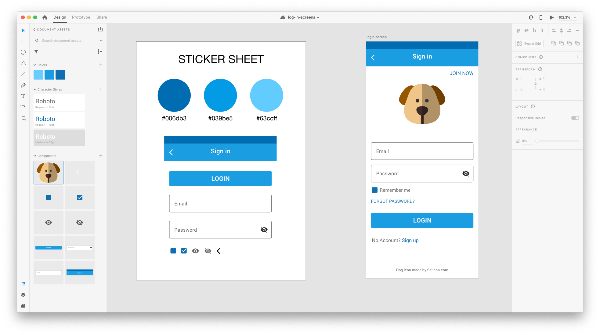

Create a sticker sheet of all your colours and components and also select your typography styles and download the icons you wish to use in this project they were selected from the [Material Design icons](https://material.io/resources/icons/?style=baseline) (sometimes you might want to create your own using the icon design principle they use in this design system)

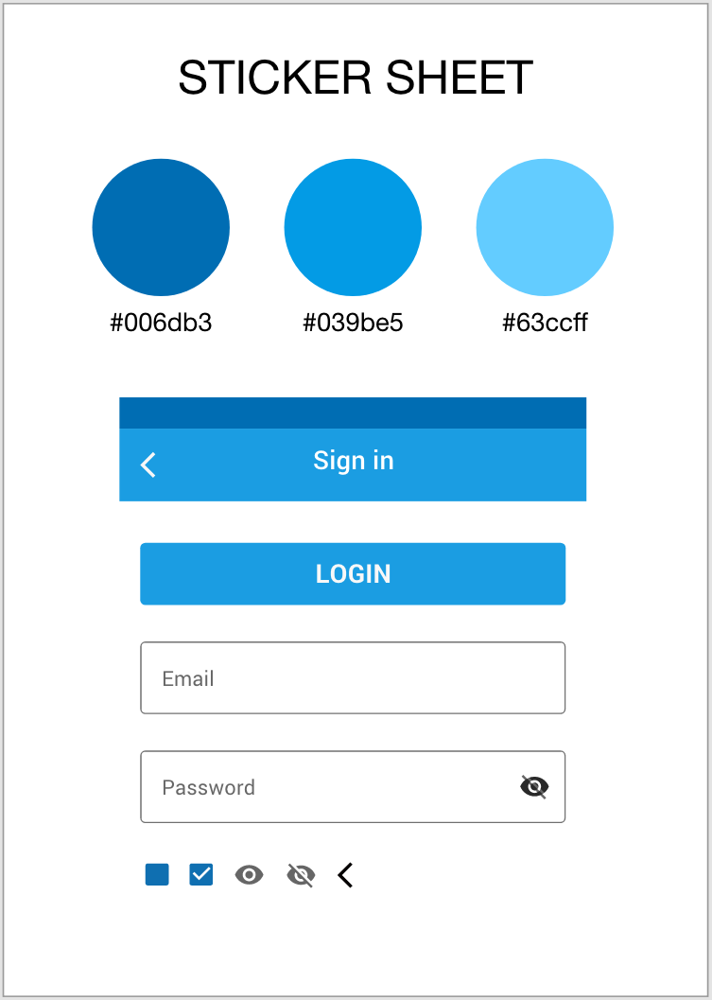

Add components to library.

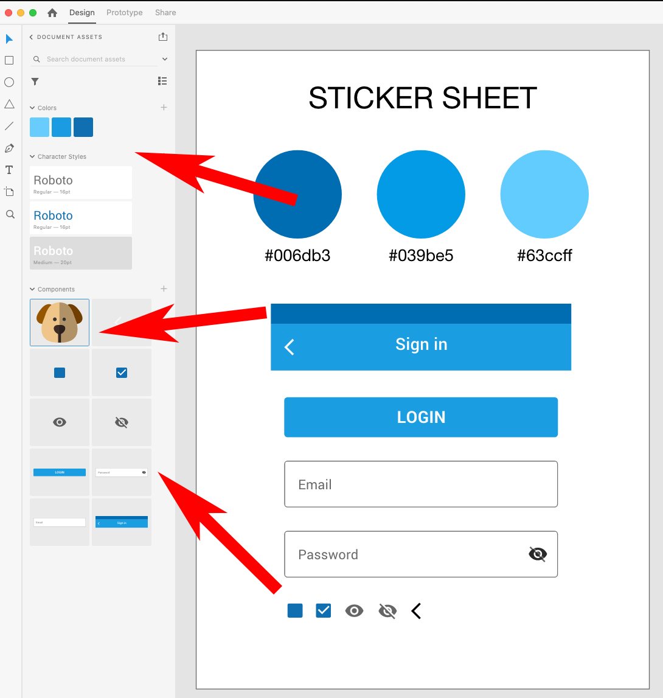

Use a design system/ platform to select your colour scheme here we have use the Google Material Design Colour Tool

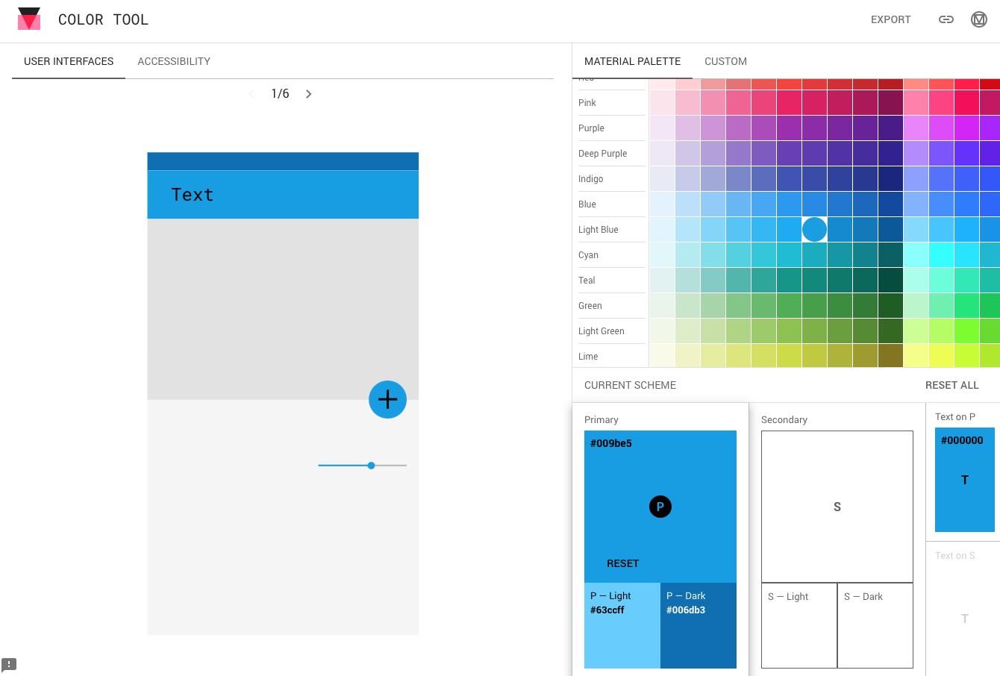

Once you have created your components it's a matter of dragging them onto a board (screen) - do we have the layers selected and you can see the hierarchy in the layers outline - we start off with all the header component.

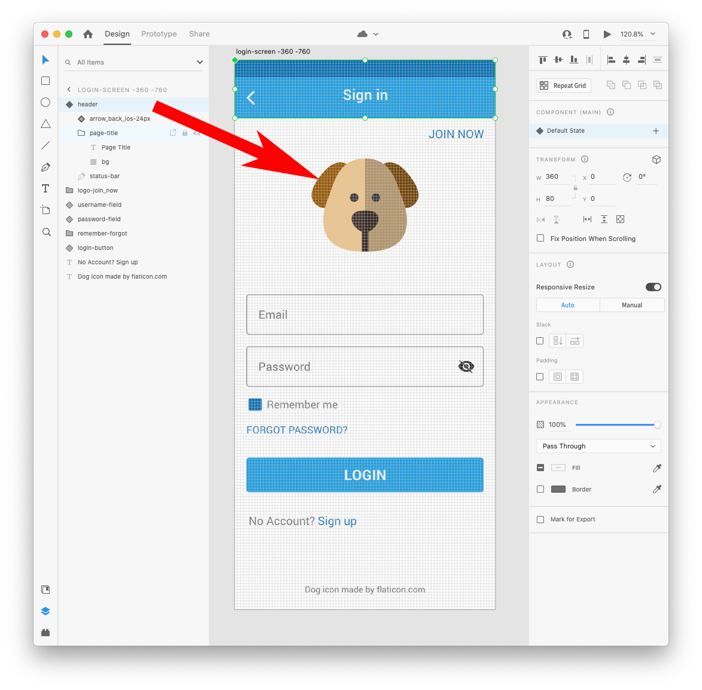

The status bar is 24 pixels high
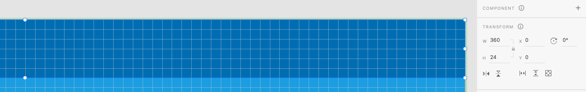

The Title box is 56 pixels high and font is Roboto medium 20pt

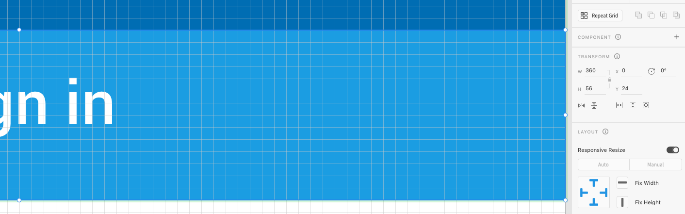

Next section is the logo and the Join Now link

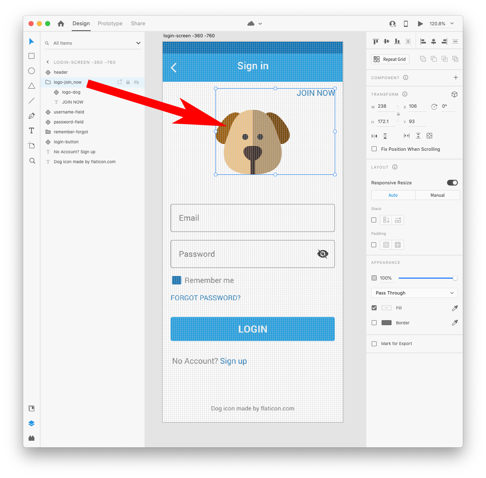

Then we move onto the username/email field - this is based upon guidance in Google material design

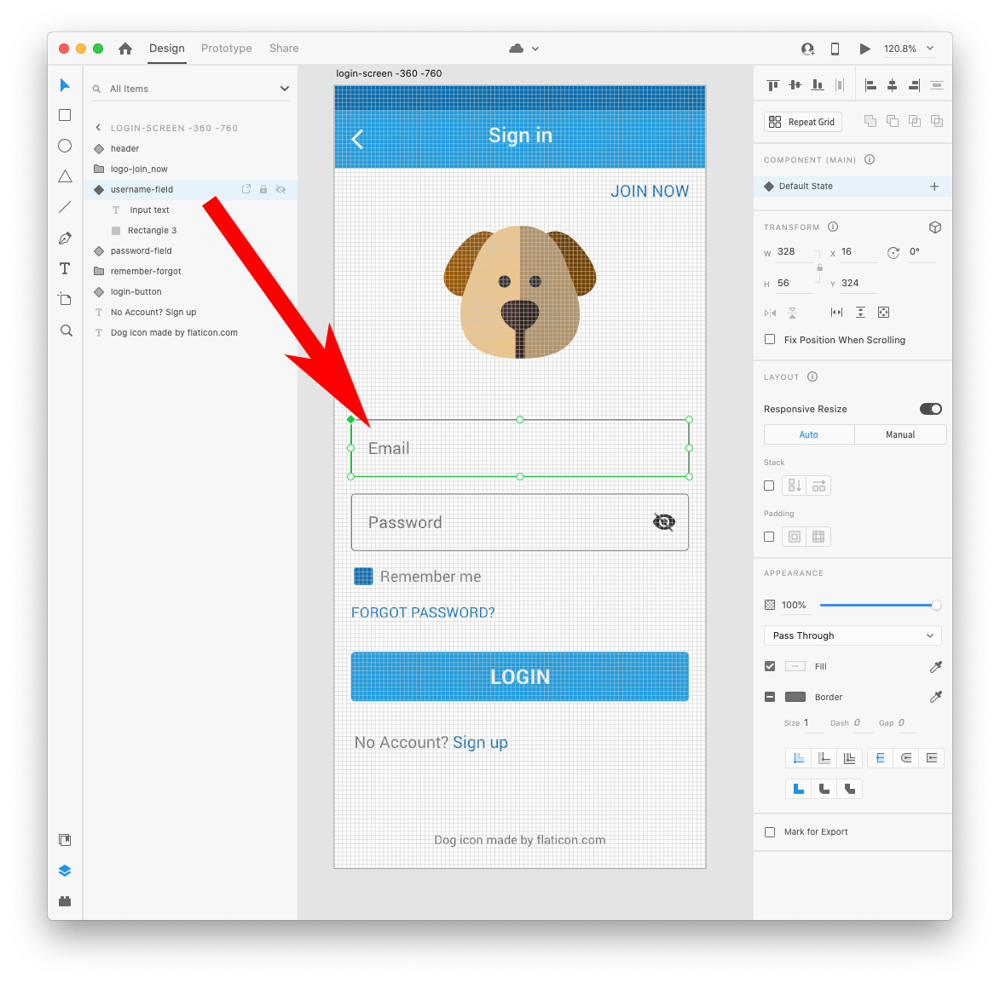

The username/email field is 238 x 56 pixels
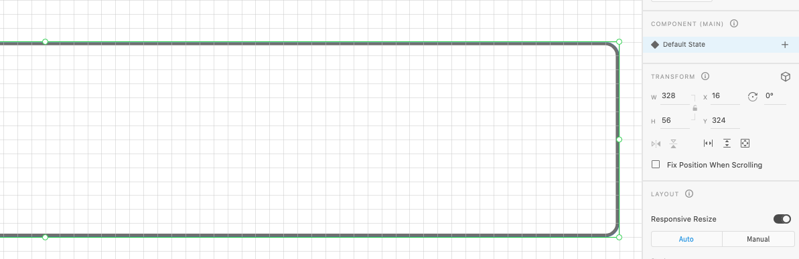

As with the username/email field the password component was added this has the option to total between the text being visible or just a set of dots.

The password field is 238 x 56 pixels

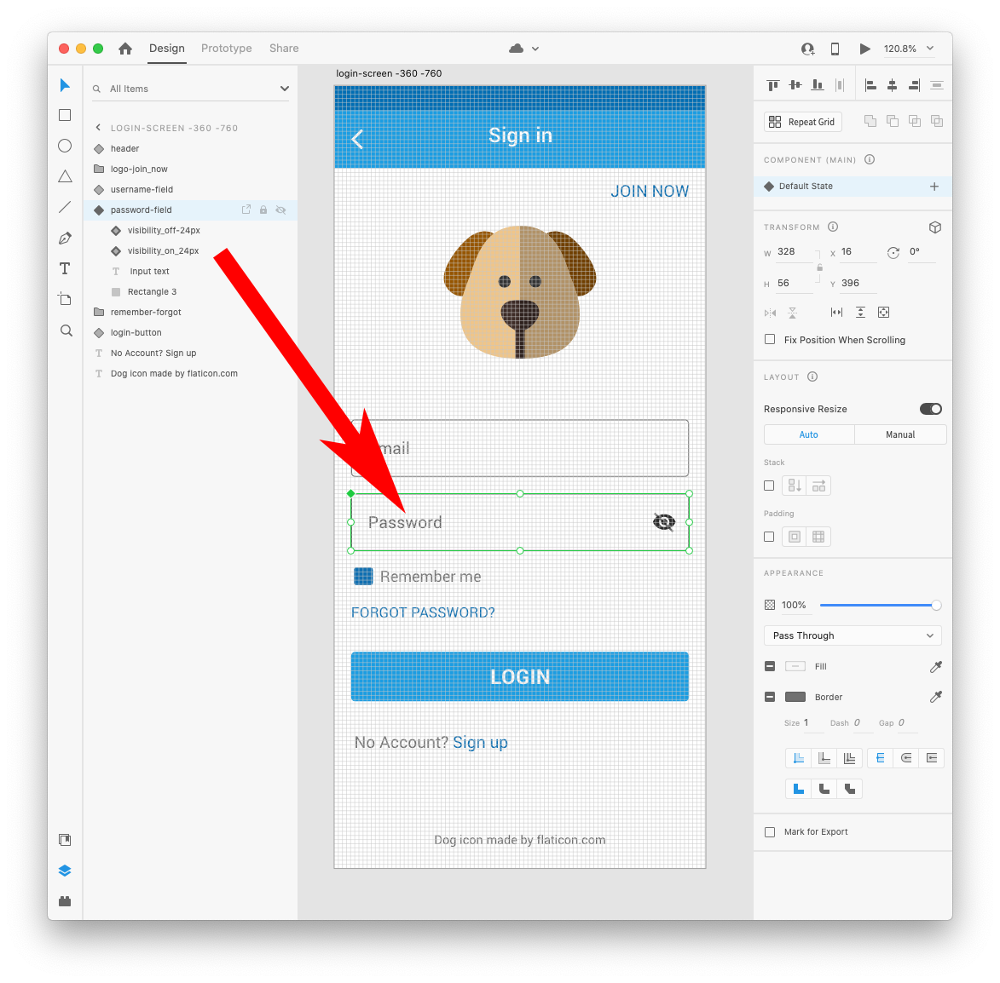

Then there is a section for remembering me, there is functionality to click to check the box and also there is a link to a forgot password word screen.

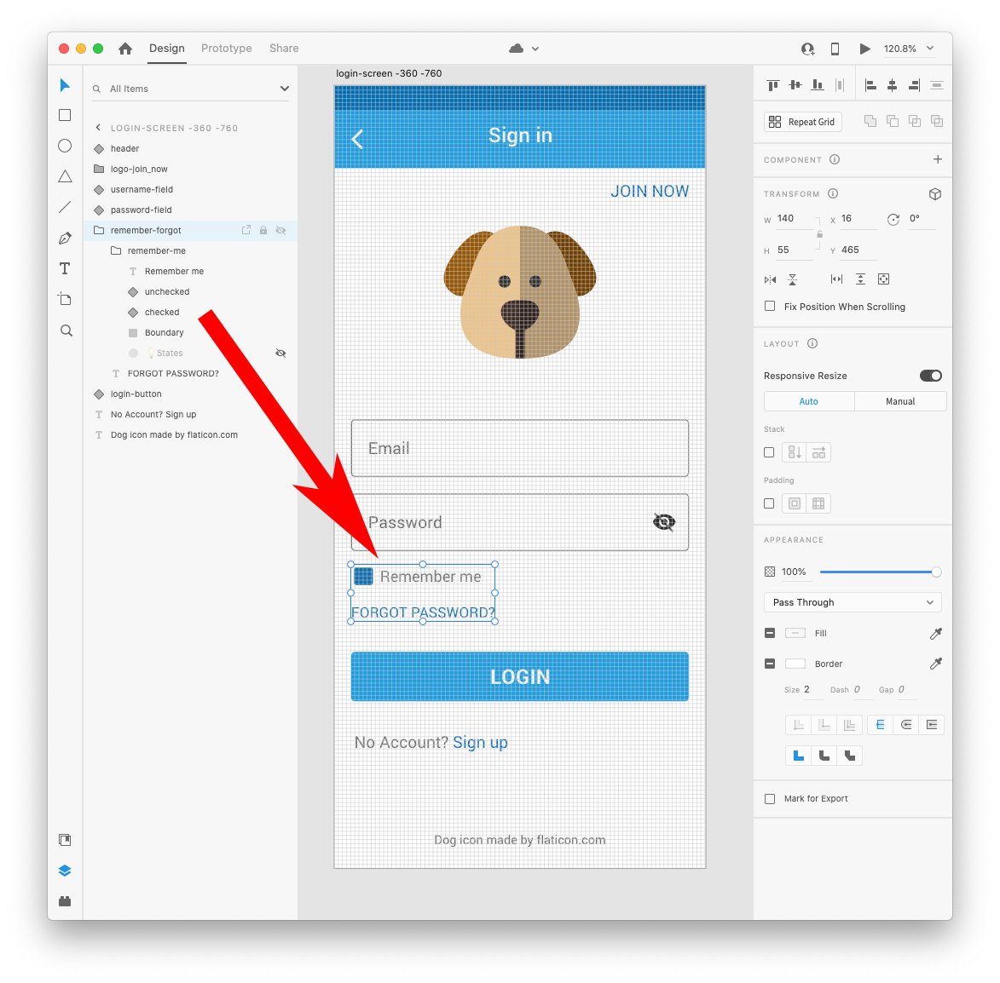

Then the login button 

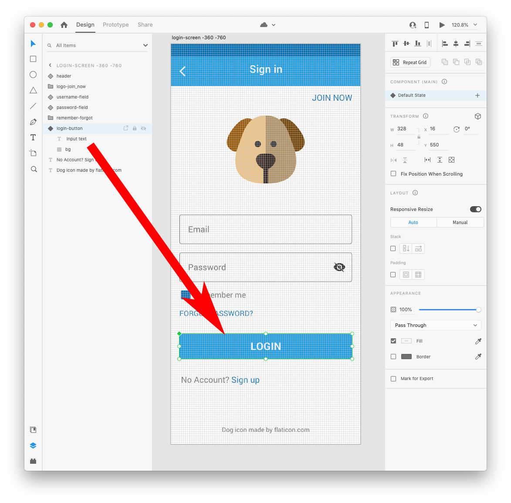

Finally there is a link for No Account  - Signup

